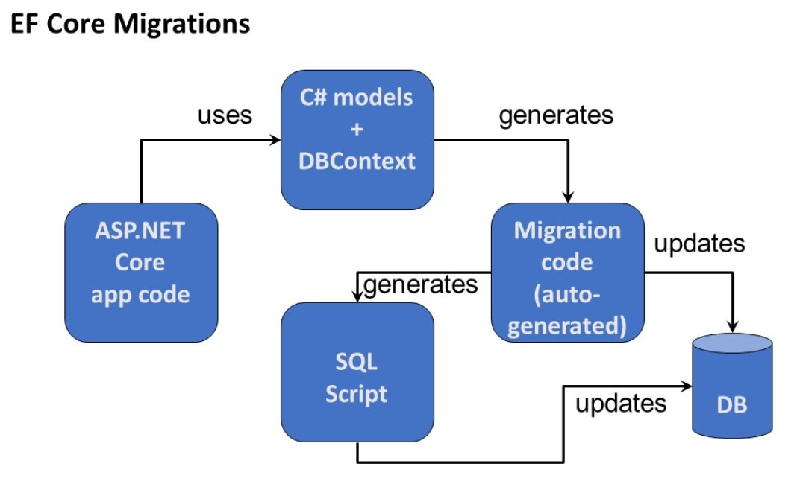
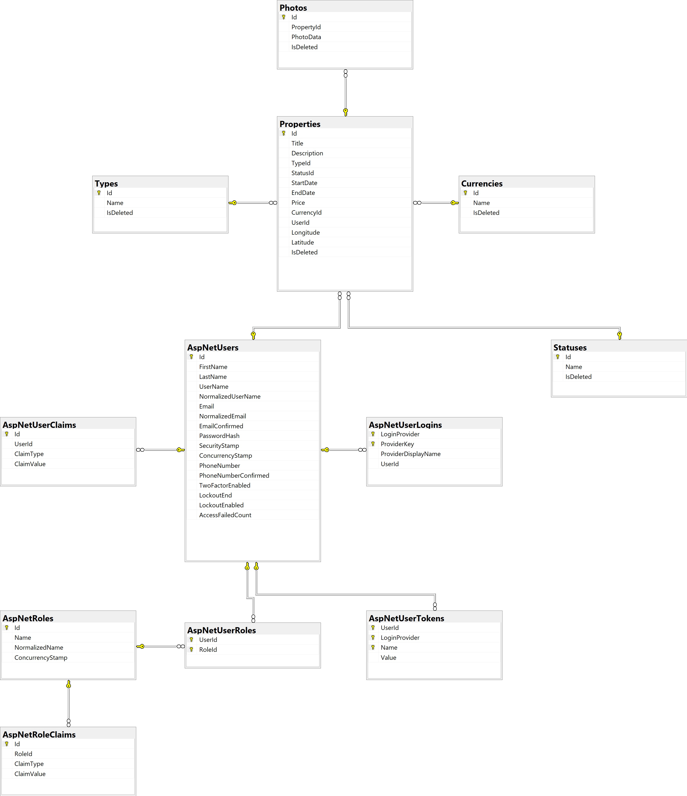

<h1 align="center">Real Estate Management System</h1>


<h4 align="center"><a href="https://www.linkedin.com/in/emreeldemir/">Emre Eldemir</a></h4> 

<br>

* *Special thanks to [Lama Dev](https://github.com/safak) for the React template. You can find the original repository [here](https://github.com/safak/react-estate-ui/tree/completed).*


<hr>

## Project Overview

The **Real Estate App** is a comprehensive platform designed for managing property listings with a focus on usability and efficiency. This application enables users to browse, create, and manage property listings, while providing robust features for both end-users and administrators.

<br>


## Tech
- **Frontend**:
    - React: Library for building the user interface.
    - Vite: Build tool and development server for fast, modern frontend development.
    - react-i18next: Library for internationalization and localization.
    - Axios: Promise-based HTTP client for making API requests.
    - Axios-Interceptor: Custom Axios interceptor for handling and modifying requests and responses.
    - Leaflet: JavaScript library for interactive maps.

<br>

- **Backend**:
    - .NET: Framework for building the server-side application.
    - Entity Framework Core (EF Core): ORM for database operations and management.
    - IdentityServer: Authentication and authorization framework.
    - Microsoft SQL Server: Relational database management system for storing user and property data.

<hr>


## Features

#### User Management
- *User Login*: Login functionality for both Admin and User roles. Pre-defined users can be used for authentication. 
- *User Registration*: New users can register by providing their details.
- *Update User Information*: Allows updating user name, email, and password. Changes are synchronized with relevant database fields.
<br>

#### Dynamic Parameters
- *Property Type Management*: Manage property types (Villa, Plot, Apartment), including adding and updating types.
- *Property Status Management*: Manage property statuses (For Rent, For Sale), including adding and updating statuses.
- *Currency Management*: Manage different currencies (TL, Dollar, Euro).
<br>

#### Property Management
- *Add New Property*: Create new property listings by specifying type, status, photos, and price.
- *Property Listing*: Filter and list properties based on type, status, and price criteria.
- *Property Details*: View detailed information about individual property listings.
- *Delete Property*: Delete listings directly from the table view.
<br>

#### Map Screen
- *Map Display*: Properties are shown on the map with markers. Each marker can be clicked to view detailed information.
<br>

#### User Interface
- *Responsive Design*: Ensures compatibility with both mobile and desktop devices.
- *Internationalization*: Offers support for Turkish and English languages using react-i18next for seamless multilingual experiences.
<hr>

## Diagrams
- JWT Token Based Auth Diagram


<br>
<br>
<br>


- EF Core Diagram




<br>
<br>
<br>

- Database (MSSQL Server) Diagram




<hr>

## Installation

Real Estate App requires [.NET 8](https://learn.microsoft.com/tr-tr/dotnet/welcome) and [Node.js](https://nodejs.org/) v20.11.1+ to run.

Download the project folder.

<br>

> Install the dependencies and start the server for Frontend:

```sh
cd .\RealEstateFrontend\
npm install
npm run dev
```
<br>

> For Backend, add migration on NuGet Package Manager Console.
```sh
add-migration initialCreate
update-database
```
> Then start the server by click "Run" on VisualStudio:

* *Also, I have dockerized the frontend and backend projects separately but I have not created compose yet.*
<hr>
